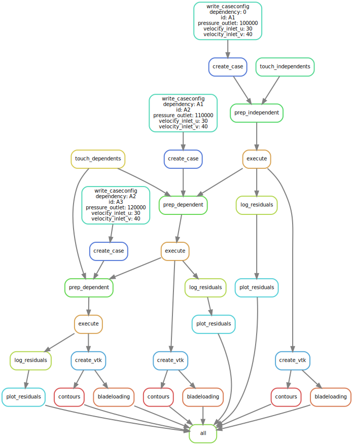

# Snakemake workflow: `NTRFlows`

[](https://snakemake.github.io)
[](https://github.com/MaNyh/NTRFlows/actions?query=branch%3Amain+workflow%3ATests)

NumericalTestRigFlows (NTRFlows)

A Snakemake workflow for `parameterstudies in cfd-simulations`

## Installation of snakemake

Have a look at the snakemake-documentation. There is no better installation-manual then theirs.

https://snakemake.readthedocs.io/en/stable/

## Deployment and Usage

Be aware, that this repository is still in early development. There are tons of issues left and the workflow will change quite a bit until it is productive.

Currently, the workflow is deployed via git. Simply clone the repo and start the workflow using snakemake.

The only dependencies needed are "snakemake, pandas, singularity/conda and slurm"

BE AWARE!

There are two configuration files where the number of processors have to be defined equally. 

- config/config.yaml
- profiles/slurm/config.yaml

This issue is documented in https://github.com/MaNyh/NTRFlows/issues/1 
It is crucial to solve this issue as soon as possible

```console
foo@bar:/path/to/somedirectory$ git clone -b master https://github.com/MaNyh/NTRFlows.git 
foo@bar:/path/to/somedirectory$ cd NTRFlows
foo@bar:/path/to/somedirectory/NTRFlows$ snakemake -j 16 -c4 --use-singularity --profile profiles/slurm
```

There will be another deployment-option that is described in the Snakemake Workflow Catalog (see Documentation below)

## Parameter Space Exploration

The parameter space exploration can be configured in  the table params.tsv

In the following example _**velocity_inlet_u**_ _**velocity_inlet_v**_ and _**pressure_outlet**_ are parameters that can be set in any file in the template-directory resources/casefiles using <PARAM parametername PARAM> (or in this case e.g. <PARAM velocity_inlet_u PARAM>). 
A table has to be identified uniquely by an "id". A dependency has to be declared. "0" means there is no dependency.

| id | velocity_inlet_u | velocity_inlet_v | pressure_outlet | dependency |
|----|------------------|------------------|-----------------|------------|
| A1 | 30               | 40               | 100000          | 0          |
| A2 | 30               | 40               | 100000          | 0          |
| A3 | 30               | 40               | 100000          | 0          |

This will result in a dag like this:


It is also possible to depend jobs on each other using the dependency-column.

| id | velocity_inlet_u | velocity_inlet_v | pressure_outlet | dependency |
|----|------------------|------------------|-----------------|------------|
| A1 | 30               | 40               | 100000          | 0          |
| A2 | 30               | 40               | 100000          | A1         |
| A3 | 30               | 40               | 100000          | A2         |




As long as ids and dependencies are well defined, you can scale the exploration as you wish 


## Documentation

The usage of this workflow is described in the [Snakemake Workflow Catalog](https://snakemake.github.io/snakemake-workflow-catalog/?usage=MaNyh%2FNTRFlows).

If you use this workflow in a paper, don't forget to give credits to the authors by citing the URL of this (original) NTRFlowssitory and its DOI (see above).


## Adapting the workflow

For any user, it is of interest to adapt the workflow for their own interest. Currently this workflow is simply a proof of concept. But where should the user start? The best strategy is, to work yourself through the rules, rule by rule. The following instructions will work for a case, where you have a mesh and ASCII-based configuration files for the simulation.

In the Snakefile you can simply outcomment all rules besides 'create'
```
"""
include all rules
"""

include: "rules/common.smk"
include: "rules/create.smk"
include: "rules/prep.smk"
include: "rules/execute.smk"
include: "rules/post.smk"
```

### Adapting 'create'

- The rule 'create' is the most generic part of the workflow. Replace all content in the template-directory with the configuration files (and directory structure) that your simulation needs.
- If you are interested in a parameterspace-exploration, define <PARAM parametername PARAM> in the configuration files. A parameter can be used in multiple files. Parameters are used to define the name of the simulation so that a user can directly see the parameters that have been used
- If you have configuration values that you want to change from time to time, you can use <CONFIG configurationname CONFIG> to replace a string in the configuration files. This might be useful for partitioning purpuses where you change the number of Processors and Nodes quite often. If you don't change a configuration often, don't define one. Then just leave the values in the template be.

### Adapting 'prep'

- replace the containerfile definition with a container that you'd like to use. You don't necessarily need to use a container, but then obviously your work is not reproducible.
- redefine output.preped. Another solver will generate a different structure for the executable simulation
- redefine the shell commands. You need at least commands to read the mesh into your simulation and probably you want partitioning commands here

### Adapting 'execute'

- replace the containerfile definition with a container that you'd like to use. You don't necessarily need to use a container, but then obviously your work is not reproducible.
- redefine the input-files
- redefine the output-files (what files does your solver generate when successfully conducting a simuklation?)
- redefine the shell-commands

### Adapting 'post'

This is the most individual part of a simulation. You will need to be a bit more creative here, but you can use the given structure for sure.
